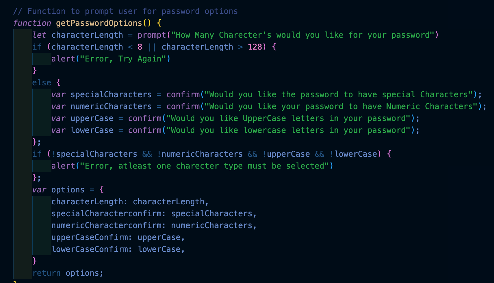
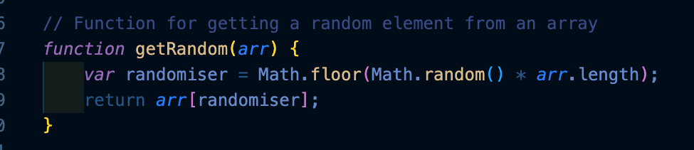
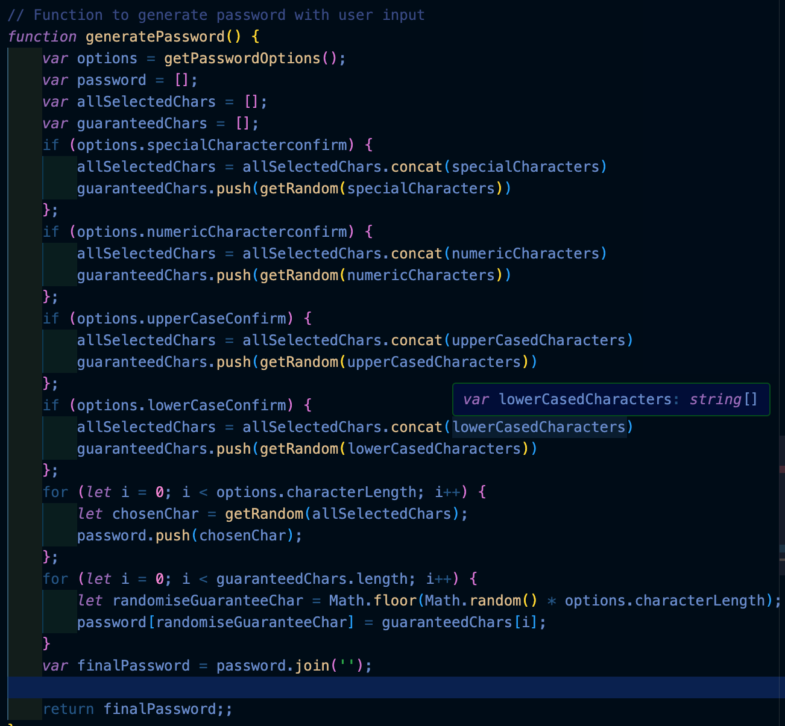

# password-generator

## Table of Contents: 
* [Installation](#installation)
* [Usage](#usage)
* [Credits](#credits)
* [License](#license)

Installation: 

For this task, the HTML file and CSS stylesheet were completed, however this needed to be transferred to a new Repo.

Step 1: Creating a Repo. 

In this step, Create a Repo which also has a readMe file attached.

Step 2: creating the folders and files for the repo:

// Since the HTML file and CSS files were already completed, This step required creating a blank HTML pages CSS pages to copy the code onto using "touch<file name>".css & "touch<file name>.HTML". 

Step 3: Creating the code: 

starting with the base code:

Step 4: Creating the prompts

Since the task was to create a password generator with some previous code completed using Javascript, I was tasked with completing research to understand how to create indivisual elements of the password generator, this was done through research on Youtube as well as mdn web docs_ and help from the great teaching assistants and my fellow students in a study group. 

The first thing required was to create a prompt which asks the user how many charecters they would like their password to have, ensuring that the user was limited to picking a password that is between 8 charecter 128 charecter as per the guidelines. This was done by utilising an If statemtent. 

The following step was to create prompts which asks the user what charecter's the user would like to be included in their randomly generated password. this was done using confirm prompts, ensuring that an error is produced if the user declines all options as per the guidlines.

THe final step in creating the prompts is ensuring that the variables can be accessed in other sections of the code, this was done by creating objects which are reflective of the charecter options utilised in the prompts. Since the previously declared variables are localised, without this step, the other sections of the code would not be able to read them. 

Step 5: creating a randomiser:

The next step in building the program was ensuring that the charecter's selected from the array's were randomised. this was done by building a function that would look through each character array and select a charecter at random. 

Final step: creating the gernerate password function: 

The final step in the process, required combining all of the provided arrays containing special charecters, numeric charecters, lowercase characters and uppercase characters using concatination, ensuring that the selected charecters are added to the password by creating an array where they are stored and using .push and utilising a for loop which loops though and creates a password with the selected number of charecters, and a second for loop which ensures that the some charecters in the final password are replaced by the specificed special charecters.

Usage: 

    the page can be used to create secure randomly generated password for any purpose. Using the prompts, the password can be tailored to the requirements of the specific website. 

Credits: 

    Repo is made by myself, base code was provided by the university and the code thereafter was created with the help of my colleagues in the a study group, the help of teaching assistants and research completed on mdn web docs, youtube and stack overflow.

License:

    See License in Repo